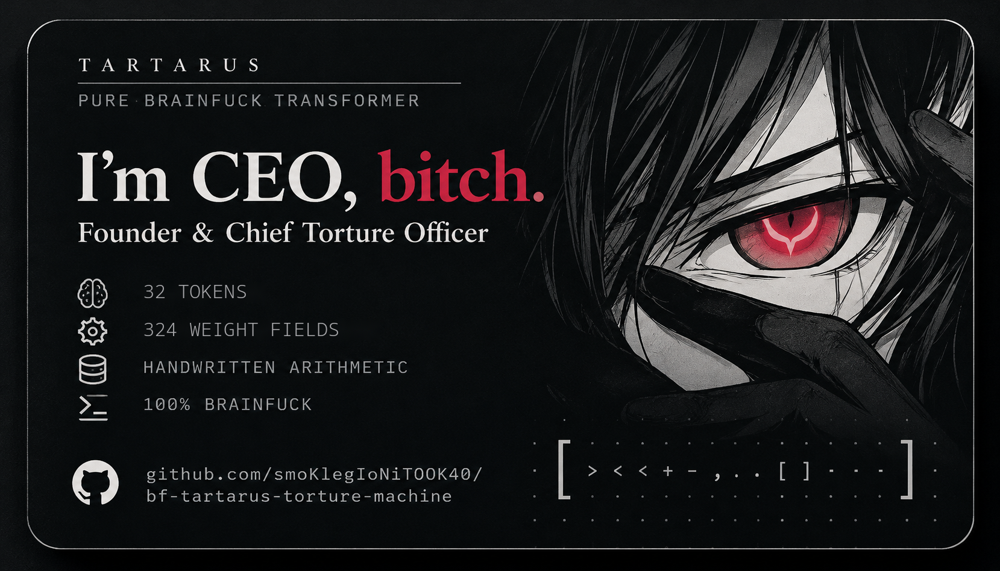

# Tartarus

**A tiny Transformer in handwritten Brainfuck, built by a human + Codex duo.**

Tartarus explores Transformer inference, autoregressive generation and bounded discrete learning with all model mathematics executed in Brainfuck. The local prototype now has a **32-slot forward engine, 324 weight fields and a BF-controlled generation loop**. Its tokenizer and renderer support **all 26 lowercase Latin letters and space**.

**Public status: documentation only.** Implementation, weights, corpora, runnable tests and detailed technical reports remain local. The results below are locally recorded and cannot yet be reproduced from this repository.

Status recorded on **10 October 2026 — stage 46, V11**.

## Current local prototype

| Component | Current implementation |
| --- | --- |
| Architecture | One quantized decoder block, one causal attention head |
| Dimensions | Model width 2, FFN hidden width 2, context 4 |
| Forward pass | Embeddings, Q/K/V/O projections, normalized causal attention, residuals, signed ReLU FFN and output heads |
| Arithmetic | Integer arithmetic, signed values, wide accumulators and signed 16-bit logits |
| Native capacity | 32 embedding slots and 32 output heads |
| Character mapping | 29 assigned IDs: 26 lowercase letters, space, BOS and EOS; 3 reserved slots |
| Migrated learned vocabulary | 16 IDs: BOS, EOS, space and the letters `a b c d e h i l m n o r t` |
| Weights | Fixed V11 format: 324 fields in a 336-byte request packet |
| Generation | Weights loaded once; full forward, context shift, step counter and EOS stopping run inside BF |
| Step budget | 0–99 steps; diagnostic replay continues for the requested count, including after EOS |
| Current entry | Trusted inputs from the tested migration family; general packet/family validation is next |

The calling card's “32 tokens” describes engine capacity. The codec and numerical forward path support the full alphabet, and hand-configured copy controls exercise every letter. **The learned bundles have not yet been trained on the added letters.** Alphabet support does not imply general language ability.

## What it currently generates

Separate preserved bundles produce these short sequences from their tested starting contexts and prefixes:

| Bundle | Sequences |
| --- | --- |
| Earlier multiword bundle | `hello hi`, `hi hi` |
| Curriculum bundle | `terra to`, `to to` |

The migrated bundles reproduce those sequences in the new 32-head BF loop and stop at EOS. Each next ID comes from a Transformer forward pass. The decoder maps IDs to characters; it does not store completed phrases. No host process feeds predictions back between generation steps.

Learning is still a constrained discrete search over selected parameters, with most fields fixed by hand. The latest joint lexical-fit bundle retains errors such as `helo hi` and `telo hi`:

| Partition | Next-token examples | Errors |
| --- | ---: | ---: |
| Training | 18 | 4 |
| Validation | 12 | 9 |
| Test | 12 | 5 |
| Total | 42 | 18 |

These figures describe a tiny, iteratively developed synthetic corpus, not an untouched language benchmark. Stage 46 added compatibility and generation infrastructure; it did not retrain the model or fix its existing errors.

## Latest milestone: 16 → 32 compatibility

A handwritten BF bridge migrates **16 existing bundles from 180 to 324 weight fields**, preserving their original embeddings, core and output heads. The added embeddings are zero; each added head has a fixed score of −99. Original bundles and earlier engines remain available locally as regressions.

Exact preservation of the old argmax is conditional: it applies to raw profile 0 when the old maximum is at least −99. Equal scores keep the earlier old ID. A deliberate −100 counterexample confirms that an added head can otherwise win. Semantic profiles mask different IDs and are not covered by that exact equivalence claim.

The new BF loop loads weights once, clears transient state between steps, executes the complete backbone and all 32 heads, saves the selected ID, shifts the four-ID context and manages the count and EOS. The tested autoregressive entry is limited to the migrated, bounded old-vocabulary family in raw profile 0. Arbitrary V11 weights and general semantic-profile generation are not certified by this milestone.

## Verification

Numerical references, labels, losses, selection, weight export and numerical assertions execute in BF through an ordinary, unmodified interpreter. The independent reference uses a separate lookup and scalar calculation path; the earlier 16-ID engine serves as an additional comparator.

Stage 46 freshly checked:

- **3,040 complete records on each of the native16 and native32 engines:** 1,264 single-step records and 1,776 diagnostic replay records. Native32 records include all 32 logits, winning score and ID, checked against BF reference results; native16 records provide a further compatibility comparison.
- **80 EOS-generation cases on each engine**, covering 16 starts and budgets of 0, 1, 2, 9 and 99 steps.
- **600 executed tape/pointer boundary checks**, with clean snapshots and **1,200 deliberately injected pointer or cell faults**.
- Preservation of all 324 fields across all 16 migrated bundles, full 2,700-cell final-state checks and an independently updated final context.
- Exact byte-concatenation and source/hash audits covering **1,819 assembled programs and 1,986 BF sources** for this stage.

The stage recorded **5,675 positive checks and 1,213 expected negative controls across four passing suites**. Negative controls include the injected faults, dirty checker inputs and the unsupported −100 migration case; they are expected detections, not unexplained failures.

The cumulative local ledger is **208,819 positive checks, 12,308 expected negative controls and 149 passing suite verdicts**. The latest aggregate combines four fresh suites with 145 saved earlier verdicts. It is not a fresh rerun of all historical tests.

The declared stage-46 record set is not an exhaustive 16⁴ or 32⁴ context test. Repeated reference requests reuse already computed BF-result bytes only when their input bytes match exactly; the record count is not a count of distinct oracle calculations. Stage 45 separately checked **10,640 full native32 records** for the hand-configured copy family and its controls. These checks establish numerical behavior within the tested families, not language quality.

## The rules

- New BF modules are written by hand; existing modules may be edited by hand. No generator, transpiler, template or macro produces BF commands from another language.
- Model arithmetic, matrix multiplication, attention, FFN, logits, argmax, context updates and output execute in Brainfuck.
- Training, synthetic target generation, error counting, candidate selection, weight export and independent numerical verification also execute in BF.
- An ordinary, unmodified BF interpreter runs the programs. No Python, C, Rust, BLAS, NumPy or external numerical runtime performs model computation.
- Automated assembly is allowed **only as exact byte copying and concatenation of ready, handwritten BF fragments**, without changing, stripping or adding bytes.
- Pointer and tape contracts at module boundaries are checked by executed BF tests, including deliberately broken joins. A written contract alone is insufficient.

Host tools edit literal files, route inputs and outputs, invoke the interpreter, and handle byte comparisons, hashes, file sizes and routing metadata. They do not compute model results. Byte-preserving assembly makes the growing codebase easier to manage while retaining handwritten BF computation.

## Progress and next steps

| Stages | Milestone |
| --- | --- |
| Early experiments → 25 | Four-token synthetic tasks, positional copy, word generation, then eight-ID `hello hi` / `hi hi` |
| 26–40 | 16-ID infrastructure, broader lexical experiments and packet/framing work |
| 41 | Full lowercase alphabet tokenizer and renderer |
| 42–44 | 32-slot embedding lookup, 32 output heads, then a complete native32 forward pass on one BF tape |
| 45 | Expanded numerical coverage of the copy family |
| **46 — complete** | **Old-bundle migration and BF-controlled native32 autoregression** |
| 47 — next | Checked inference32: packet framing, allowed weight families, ID/profile boundaries and rejection behavior |
| 48–49 — planned | 32-target learning objective, a small alphabet corpus, bounded training and separate held-out checks |
| 50 — planned checkpoint | Alphabet-path generation, EOS/replay, earlier regressions and a consolidated report |

The numbering is a working route, not a promise of language ability by stage 50. Additional arithmetic or validation work can move the schedule. Larger context, more capacity and better learned behavior need their own experiments.

Tartarus does not currently implement backpropagation, general training of all weights, layer normalization or open-ended language generation. A four-ID context and width-two representations are severe limits. The full native32 forward and trusted generation loop work within their tested numerical bounds; the checked entry remains unfinished.

## Who is building it?

Tartarus is a collaboration between [smoKlegIoNiTOOK40](https://github.com/smoKlegIoNiTOOK40), the human creator, and **OpenAI Codex**, an AI coding agent.

The human creator started the project, sets its constraints and direction, reviews progress and decides what gets published. Codex assists with design, directly authors and edits BF source and documentation, and runs verification through the available tools. AI involvement is disclosed explicitly.

## Publication status

This repository currently publishes the README and the creator's updated V11 calling card. Source, model bundles, datasets, runnable tests and detailed reports may be published in a later update. No public reproduction or CI claim is made while those artifacts remain local.

We are not claiming to be the first project to attempt a language model or Transformer in Brainfuck.
